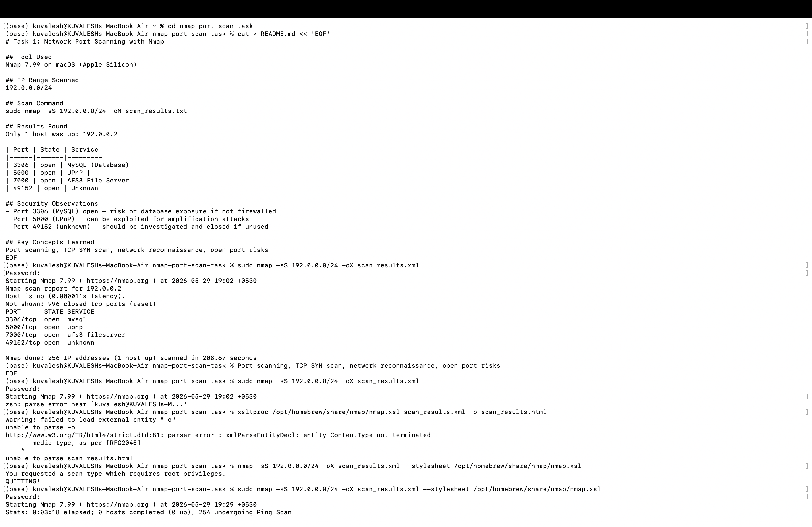

# Task 1: Network Port Scanning with Nmap

## Tool Used
Nmap 7.99 on macOS (Apple Silicon)

## IP Range Scanned
192.0.0.0/24

## Scan Command
```bash
sudo nmap -sS 192.0.0.0/24 -oN scan_results.txt
```

## Results Found
Only 1 host was up: 192.0.0.2

| Port | State | Service |
|------|-------|---------|
| 3306 | open | MySQL (Database) |
| 5000 | open | UPnP |
| 7000 | open | AFS3 File Server |
| 49152 | open | Unknown |

## Risk Analysis
| Port | Service | Risk Level | Recommendation |
|------|---------|------------|----------------|
| 3306 | MySQL | HIGH | Restrict to localhost only |
| 5000 | UPnP | MEDIUM | Disable if not needed |
| 7000 | AFS3 | MEDIUM | Block externally |
| 49152 | Unknown | HIGH | Investigate and close immediately |

## Interview Q&A

**Q1: What is an open port?**
A port actively accepting connections with a service listening on it.

**Q2: How does Nmap perform a TCP SYN scan?**
Sends SYN packet, gets SYN-ACK (open) or RST (closed) without completing full TCP handshake. Called half-open scan.

**Q3: What risks are associated with open ports?**
Attackers can exploit vulnerable services to gain unauthorized access, steal data, or crash systems.

**Q4: Difference between TCP and UDP scanning?**
TCP is connection-oriented and reliable. UDP is connectionless and harder to scan accurately.

**Q5: How can open ports be secured?**
Close unused ports, use firewalls, update services regularly, use VPN.

**Q6: What is a firewall's role regarding ports?**
Filters traffic by allowing or blocking specific ports based on rules.

**Q7: What is a port scan and why do attackers use it?**
Reconnaissance technique to find open ports and services — first step in an attack.

**Q8: How does Wireshark complement Nmap?**
Wireshark captures actual packets to verify Nmap results and analyze traffic in detail.

## Files
- scan_results.txt — raw Nmap text output
- scan_results.xml — XML format output
- scan_results.html — HTML report
- analyze.py — Python script to parse and analyze results

## Key Concepts Learned
Port scanning, TCP SYN scan, network reconnaissance, open port risks

## Output Screenshot

